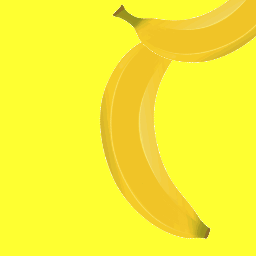

# sprinkler.js

With Sprinkler you can create an image rain on canvas and visualize and simulate streams, flows, rates, and distributions. Give it a canvas element and a list of image URLs and call start() to make it animate dropping particles e.g. bananas or frogs or anything you can imagine. There are lots of parameters to tweak particle generation, movement and transparency. Have fun!

Compatible with all the [browsers that support canvas](http://caniuse.com/#feat=canvas).

## Example apps

## Usage

The following will make the canvas rain anvils which accelerate at equal rate.

    var c = document.getElementById('canvas')
    var s = sprinkler.create(c)

    var images = [
      'img/rusty-anvil.png',
      'img/black-anvil.png'
    ]
    var stop = s.start(images, {
      ddyMin: 400,
      ddyMax: 400
    })

If you need more rusty anvils than black ones, give the image URLs as a distribution instead of an array.

    var images = {
      'img/rusty-anvil.png': 4,
      'img/black-anvil.png': 1
    }

## Installation

### Browsers

    
    <script>
      var c = document.getElementById('canvas')
      var s = sprinkler.create(c)

### CommonJS & Node.js

Install via [npm](https://www.npmjs.com/package/sprinkler):

    $ npm install sprinkler
    ---
    var sprinkler = require('sprinkler')

### AMD & Require.js

    define(['scripts/sprinkler'], function (sprinkler) { ... });

## API

### sprinkler.create(canvasElement, options)

Create a sprinkler animation on the given canvas.

Optional `options` object can take the following properties:

- `responsive`, `true` by default. When `true` then canvas element pixel size follows its styled size. This prevents browsers from scaling the canvas. That gives us full 1:1 canvas-screen pixel ratio. Set `false` to stop sprinkler resizing your canvas element.

### start(imageUrls, options)

Start the animation. Animation downloads the images in a lazy manner: instead of downloading all the images as soon as possible, it downloads an image when the image is dropped to the canvas as an particle. This feature allows you to specify even a large number of different images. Our current record is 3300.

Takes in `imageUrls` which can be an array of URL strings or a distribution object where URL strings are the keys and their numerical weights are the values. If an array is given, the URLs are sampled uniformly.

The second parameter `options` is optional object which describes the style of the animation. See below for possibilities.

Returns a `stop` function that stops the particle generation. Sprinkler allows you to run multiple `start` calls, also called *waves*, concurrently without stopping any.

Optional `options` object can take the following properties:

- `angle`, the main direction of the particle flow in radians. Top to bottom is `0`, left to right is `Math.PI / 2`. Defaults to `0`. This rotates the base x- and y-axis so you do not need to re-adjust other parameters.
- `imagesInSecond`, an average number of dropped images in a second per 1000 pixels of width. Bound to the width to keep the density the same regardless the canvas size. To let density change but the number of images stay constant instead, see `constantDensity`.
- `constantDensity`, a boolean. Defaults to `true`. Set `false` to keep image rate constant and allow density to change when the canvas size changes.
- `burnInSeconds`, number of seconds to prerun the wave. This allows there to be visible particles already at the beginning. To get an instant feeling of a consistent flow, set higher than what it would take for a particle to fall through the canvas.
- `zMin` and `zMax`, range for initial scale. Between [0, Inf]
- `rMin` and `rMax`, range for initial rotation. Between [0, 2*Math.PI]
- `aMin` and `aMax`, range for initial transparency (alpha). Between [0, 1]
- `dxMin` and `dxMax`, range for horizontal velocity. Between [-Inf, Inf]
- `dyMin` and `dyMax`, range for vertical velocity. Between [0, Inf]
- `dzMin` and `dzMax`, range for scale velocity. Between [-Inf, Inf]
- `drMin` and `drMax`, range for rotation velocity. Between [-Inf, Inf]
- `daMin` and `daMax`, range for transparency velocity. Between [-Inf, Inf]
- `ddxMin` and `ddxMax`, range for horizontal acceleration. Between [-Inf, Inf]
- `ddyMin` and `ddyMax`, range for vertical acceleration. Between [0, Inf]
- `ddzMin` and `ddzMax`, range for scale acceleration. Between [-Inf, Inf]
- `ddrMin` and `ddrMax`, range for rotation acceleration. Between [-Inf, Inf]
- `ddaMin` and `ddaMax`, range for transparency acceleration. Between [-Inf, Inf]

Values are picked randomly but uniformly from the given __ranges__.

Default values are:

    {
      angle: 0,
      imagesInSecond: 7,
      burnInSeconds: 0,
      zMin: 0.38, zMax: 1,
      rMin: 0, rMax: 2 * Math.PI,
      aMin: 1, aMax: 1,
      dxMin: -1, dxMax: 1,
      dyMin: 100, dyMax: 100,
      dzMin: 0, dzMax: 0,
      drMin: -1, drMax: 1,
      daMin: 0, daMax: 0,
      ddxMin: 0, ddxMax: 0,
      ddyMin: 0, ddyMax: 0,
      ddzMin: 0, ddzMax: 0,
      ddrMin: 0, ddrMax: 0,
      ddaMin: 0, ddaMax: 0
    }

There are a few experimental options. See the examples for usage.

- `clickModifier`: a particle manipulation function that gets called when the particle becomes clicked.
- `particleRenderer`: a custom particle renderer function. Allows you to render complex shapes.
- `tail`: additional particles that follow their parent particle.
- `xOff`: a number. Moves the particle spawning line along x-axis. Especially useful with `xSteps`.
- `xSteps`: integer. Restrict the continuous particle spawning line to N discrete points. For example, can be used to create car lanes.

### drop(imageUrls, options)

Drops a single particle. In other aspects it behaves like `start(...)` and takes in the same arguments. Does not return a `stop` function as there is nothing to stop.

## Notes for developers

Run tests with `$ npm test`.

Build with `$ npm run build`.

Serve with `$ npm start`.

## Versioning

[Semantic Versioning 2.0.0](http://semver.org/)

## License

[MIT License](LICENSE)
